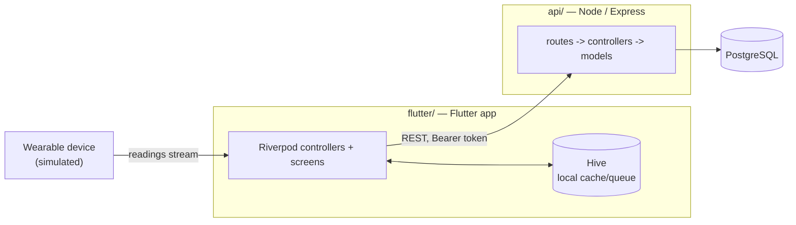

# Wearable Health & Shopping

ERBrains take-home assignment: a mobile app that syncs data from a wearable
device and includes a small shopping flow. Two projects, one repo:

- **[`api/`](api)** — Node.js + Express + PostgreSQL REST API
- **[`flutter/`](flutter)** — Flutter client ("FitRing"), Riverpod +
  Clean Architecture, talking to `api/` over REST

Original spec: [`Senior Mobile Developer Assignment 1.pdf`](<docs\Senior Mobile Developer Assignment 1.pdf>).

## System overview



## Quick start

Backend first, then the client — see each project's README for full setup,
environment variables, and test commands:

```bash
# 1. Backend
cd api
npm install && npm run db:migrate && npm run db:seed && npm start

# 2. Flutter client (separate terminal)
cd flutter
flutter pub get
dart run build_runner build --delete-conflicting-outputs
flutter run
```

Demo login (seeded by the backend): `demo@erbrains.io` / `password123`.

- [`api/README.md`](api/README.md) — backend setup, env vars, running tests
- [`flutter/README.md`](flutter/README.md) — client setup, running tests

## Documentation

This README covers only the top-level overview. Everything else — system
and per-project architecture, the database schema, the full API reference,
the wearable integration approach, the offline sync design, and the
reasoning behind every non-obvious technical decision — lives in
[`docs/`](docs), which is the source of truth for all of it:

| Doc | Covers |
|---|---|
| [`docs/ARCHITECTURE.md`](docs/ARCHITECTURE.md) | System context, backend MVC layering, Flutter Clean Architecture layering, request-flow and checkout sequence diagrams, error handling |
| [`docs/DATABASE.md`](docs/DATABASE.md) | Full ERD, constraints, and idempotency design |
| [`docs/API.md`](docs/API.md) | Endpoint reference, auth model, worked `curl` example |
| [`docs/WEARABLE_INTEGRATION.md`](docs/WEARABLE_INTEGRATION.md) | `WearableService` abstraction, mock → real SDK swap path, connection/retry state machine |
| [`docs/OFFLINE_SYNC.md`](docs/OFFLINE_SYNC.md) | Reading + cart/order offline queues, conflict resolution, retry/backoff, OS-level background sync, cache policy |
| [`docs/DECISIONS.md`](docs/DECISIONS.md) | Every major technical decision and trade-off, backend and Flutter, plus explicit scope exclusions |

## Testing

```bash
cd api && npm test          # 33 tests — routing/business logic against a mocked db
cd flutter && flutter test  # 7 tests — offline sync engine correctness against fakes
```

See each README's Tests section for what's covered and what deliberately isn't.
