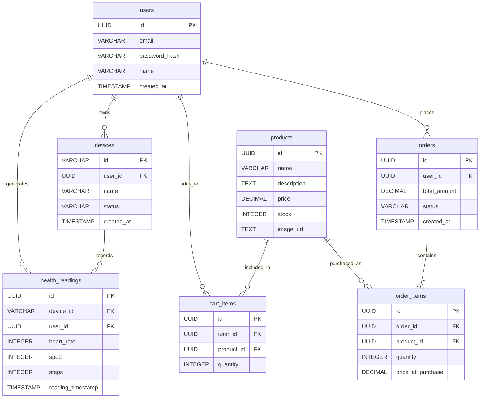

# Wearable Health & Shopping API

Backend for the *Wearable Health & Shopping* mobile app (ERBrains take-home
assignment). Node.js + Express + PostgreSQL.

This README is written so that someone fairly new to backend development can
follow it end to end. Every section starts with a **"In plain English"** box
that explains the idea using an everyday comparison, and then follows with
the precise technical details for anyone who wants them. Skip the boxes if
you already know the concept — nothing after them repeats what's in the box.

---

## Architecture

> **In plain English:** think of this backend like a small restaurant.
>
> - The **kitchen** is where the food (data) actually lives and gets
>   prepared — that's our `models/` folder, which is the only part of the
>   code allowed to touch the database.
> - The **waiter** takes your order, decides what to tell the kitchen, and
>   brings the food back to your table — that's our `controllers/` folder.
>   A waiter never cooks; a controller never writes SQL.
> - The **host who seats you** just points you to the right waiter for
>   what you're asking for — that's `routes/`. It does no thinking of its
>   own, it just says "this kind of request goes to that controller."
> - Since this is a delivery-only kitchen (a JSON API, not a website with
>   pages), there's no dining room to decorate — the "view" is just the
>   plate of food itself, i.e. the JSON we hand back.
> - The **bouncer at the door** checks your wristband before you're even
>   allowed to place most orders — that's our `middleware/auth.js`, which
>   we'll come back to in the API docs section.
>
> This overall shape — Model, View, Controller — is called **MVC**, one of
> the most common ways to organise a backend. We're using a version of it
> without a real "View" layer, because a JSON API doesn't render pages.

Applied plainly here — no framework magic, no layer that isn't earning its
keep at this size:

```
server.js       -> loads env vars, starts the HTTP listener (opens the kitchen)
app.js          -> Express app: middleware + route mounting (exported, no listen())
routes/         -> thin wiring only — path -> controller function, nothing else
controllers/    -> the "waiter": parses the request, validates it, picks a
                    status code, calls the model, shapes the JSON response
models/         -> the "kitchen": one file per resource, owns all SQL for
                    that resource. Never touches req/res — doesn't know an
                    HTTP request exists.
middleware/     -> auth.js: verifies the bearer token and exposes req.auth
utils/          -> small stateless helpers shared across layers (password.js)
db.js           -> pg Pool wrapper (query + transaction helper) — the only
                    file that talks to the `pg` package directly; every
                    model goes through it instead of connecting itself
database/       -> schema.sql, seed.sql and the Node scripts that run them
tests/          -> Jest + Supertest, route logic tested against a mocked db module
```

A request only ever flows in **one direction**:
`routes → controllers → models → db.js`. A model never calls a controller,
and a controller never runs SQL directly. Keeping that rule strict is what
makes `models/*.js` reusable on their own and easy to test in isolation —
today they're exercised indirectly through the controller tests, via a
mocked `db` module (more on that in Testing).

**Why this split and not a heavier one** (for example, adding a "services"
layer between controllers and models, the way some larger codebases do):
every controller action here is *one* HTTP request mapped to *one* piece of
business logic, and that logic already lives naturally in the model that
owns the SQL for it. Look at `order.model.js`'s `createFromCart` — the
whole checkout transaction (turn a cart into an order) is business logic,
and it's exactly as much "model code" as fetching a single row is. Adding a
services layer on top would mean most service methods just forward straight
through to a model method with no logic of their own added — that's
indirection for its own sake, which the assignment explicitly asks us to
avoid ("avoid unnecessary complexity").

`app.js` is kept separate from `server.js` specifically so it can be
`require`d by the tests without opening a real network port or needing a
live database — tests import the "kitchen + waiters," never actually
"open the restaurant."

---

## Setup

> **In plain English:** these commands, in order, are: *"download the
> tools this project needs"* → *"tell it your personal settings, like your
> database password"* → *"build the empty shelves in the pantry"* → *"put
> some starter groceries on those shelves"* → *"open for business."*

```bash
npm install
cp .env.example .env   # or edit the existing .env — see variables below
npm run db:migrate     # creates tables (idempotent, safe to re-run)
npm run db:seed        # inserts sample data (see below)
npm start               # http://localhost:3000
```

What each step actually does:

1. **`npm install`** downloads every package this project depends on
   (Express, `pg`, `cors`, etc.) into a `node_modules` folder. You only
   need to run this again if `package.json` changes.
2. **`.env`** is a small text file holding settings that are different on
   every machine — your database password, which port to use — and are
   *not* committed to source control (see `.gitignore`), because they're
   either secret or personal to your setup. `.env.example` is a template
   with the shape filled in but no real secrets.
3. **`npm run db:migrate`** runs [`database/schema.sql`](database/schema.sql)
   against your PostgreSQL database. This is the step that actually
   creates the tables (`users`, `devices`, `health_readings`, and so on) —
   without it, the database is just an empty, nameless container with
   nothing in it. It's safe to run more than once; it only adds what's
   missing (see the Database section below for exactly how).
4. **`npm run db:seed`** runs [`database/seed.js`](database/seed.js), which
   inserts realistic starter data — sample products, a demo user, some
   health readings — so the API has something to return the moment you
   start testing it, instead of you having to create every row by hand
   first via Postman or curl.
5. **`npm start`** actually launches the Express server and starts
   listening for requests on `http://localhost:3000`.

Running `npm run db:seed` ([`database/seed.js`](database/seed.js)) gives
you:

- 5 sample products, each with a placeholder `image_url` ([`database/seed.sql`](database/seed.sql))
- a demo user — `demo@erbrains.io` / `password123` / name "Jordan Lee" — log in with `POST /auth/login`
- a demo device (`FITRING-001`) owned by that user
- ~3 days of health readings at 15-minute intervals, so `/health/readings` and
  `/health/summary` have something to return right away
- one completed order, so `/orders` isn't empty on first call

It's idempotent — re-running it won't duplicate the user, device, readings, or order.
("Idempotent" just means: running it once, or running it five times in a
row, leaves the database in exactly the same state either way — nothing
piles up.)

Environment variables (`.env`):

| Variable      | Purpose                        |
|---------------|---------------------------------|
| `PORT`        | HTTP port (default 3000)        |
| `DB_USER`     | PostgreSQL user                 |
| `DB_HOST`     | PostgreSQL host                 |
| `DB_NAME`     | Database name                   |
| `DB_PASSWORD` | PostgreSQL password              |
| `DB_PORT`     | PostgreSQL port (default 5432)  |

---

## Tests

```bash
npm test
```

> **In plain English:** these tests never talk to a real database — they
> replace (a developer would say "mock") the database module with a fake
> stand-in that just returns whatever answer the test tells it to. That's
> like rehearsing a play with a cardboard cutout instead of the real actor:
> you can't check whether the *cutout* remembers its lines, but you can
> definitely check whether everyone else on stage reacts to it correctly.
> Here, that means we're testing "does the controller do the right thing
> given this database result," not "does Postgres itself work" (Postgres
> already works — that's not our code to test).

Route handlers are tested against a mocked `db` module (no live database
required), covering the areas most likely to cause data loss or incorrect
business results:

- **Auth middleware**: missing/malformed tokens rejected with `401`, a token whose
  `userId` doesn't match the requested resource rejected with `403`, public routes
  (`/auth/login`, `GET /products*`) reachable with no token at all.
- **Health readings**: request validation, and duplicate-skip counting for the
  `ON CONFLICT (device_id, reading_timestamp) DO NOTHING` sync path.
- **Cart**: validation, quantity merging via `ON CONFLICT (user_id, product_id)`, and
  the `PATCH`/`DELETE` endpoints' ownership check (scoped to `user_id`, not just `:id`).
- **Orders**: rejecting checkout on an empty cart, the full checkout transaction
  (cart snapshot → order + order_items → cart cleared) via the mocked `db.transaction`,
  and the `item_count` aggregate on `GET /orders`.

---

## Database

> **In plain English:** think of a relational database as a filing cabinet
> with several drawers (**tables**), and each drawer is full of index cards
> (**rows**). One drawer is "Users," one is "Orders," one is "Products," and
> so on. The clever part is that instead of *copying* a whole user's
> details onto every order card, an order card just writes down the user's
> ID number — like a locker tag pointing back at the right locker instead
> of duplicating what's inside it. That pointer is called a **foreign
> key**, and it's how tables relate to each other without repeating data
> everywhere. A **UNIQUE constraint** is a rule that says "no two cards in
> this drawer are allowed to have the same value here" — for example, no
> two users can share an email address.



**How to read the diagram in plain English:** the lines with a crow's-foot
(`}o`) mean "many." So `users ||--o{ devices : owns` reads as *"one user
can own many devices, but every device belongs to exactly one user"* — the
same shape as one parent having many kids, but every kid having exactly one
birth certificate naming their parent. The same pattern repeats everywhere:
one user has many health readings, one product can be in many people's
carts, one order can contain many order items.

**Why `order_items` exists separately from `orders`, and separately from
`products`:** an order can contain several products, and a product can
appear in several orders — that's a "many-to-many" relationship, and a
filing cabinet can't directly express that with a single pointer. So we add
a small connector drawer (`order_items`) whose whole job is pairing one
order with one product, one row per pairing, with its own quantity and
price. This is also *why* `order_items.price_at_purchase` exists instead of
just looking up the current price from `products` — if the price changes
next week, an order placed today should still show what you actually paid,
not today's price. This is a very common real-world database pattern:
"snapshot the price at the moment of the transaction."

The runnable version of this schema is [`database/schema.sql`](database/schema.sql). Notable
constraints beyond the diagram:

- `health_readings` has `UNIQUE (device_id, reading_timestamp)` — this is what makes
  `POST /health/readings` idempotent: re-uploading the same reading after a failed sync
  is a no-op instead of a duplicate row. (Plain English: it's the database's own
  "no two identical index cards allowed" rule, and we lean on it instead of writing
  our own duplicate-checking code.)
- `cart_items` has `UNIQUE (user_id, product_id)` — `POST /cart` upserts onto this,
  incrementing quantity instead of creating a second line item for the same product.
  ("Upsert" is a mashup of "update" and "insert" — try to update a matching row, and
  if none exists yet, insert a new one instead. It's one instruction instead of
  "check if it exists, then decide.")
- `products.name` is `UNIQUE` — that's what makes `database/seed.sql`'s
  `ON CONFLICT (name) DO NOTHING` an actual no-op on re-seed instead of duplicating rows.
- Foreign keys **cascade on delete** (e.g. deleting a user cleans up their devices, readings,
  cart items and orders) — plain English: delete the locker, and everything filed as
  "belongs to this locker" gets cleaned up automatically instead of turning into orphaned
  paperwork nobody can find the owner of.
- `schema.sql` ends with a few `ALTER TABLE ... ADD COLUMN IF NOT EXISTS` / guarded
  `ADD CONSTRAINT` statements so `npm run db:migrate` stays safe to re-run against a
  database that was created before `users.name` / `products.image_url` existed.

---

## API Documentation

> **In plain English:** picture a theme park. When you arrive, you check
> in once (log in) and get a wristband (a **token**). For the rest of the
> day, every ride (every API endpoint) just glances at your wristband
> instead of asking you to show ID again — that's what
> `Authorization: Bearer <token>` means: *"here's my wristband, let me on
> the ride."* Crucially, your wristband only proves *who you are* — it
> doesn't automatically let you cut in line and ride using someone else's
> ticket. So every ride here also double-checks: *"does the name on this
> wristband match the name on the ticket you're handing me?"* That
> matching check is what stops one logged-in user from reading or changing
> someone else's data just by guessing their ID.
>
> Each row in the tables below is one "ride": a **method** (what kind of
> action — `GET` looks without changing anything, like peeking in a
> window; `POST` creates something new, like ordering a new souvenir;
> `PATCH` changes part of something that already exists; `DELETE` removes
> it), a **path** (which ride/booth you're walking up to), and what you
> get back.

All endpoints accept/return JSON. Errors are `{ "error": "..." }` with a 4xx/5xx status.

**Auth:** every route below except `POST /auth/login` and the two `GET /products` routes
requires `Authorization: Bearer <token>` (the token `POST /auth/login` returns). Routes
that also take a `userId` in the body/query additionally verify it matches the token's
`userId` — a valid token for one user can't read or act on another user's data. See
[middleware/auth.js](middleware/auth.js).

### Auth (public)
| Method | Path | Body | Notes |
|---|---|---|---|
| POST | `/auth/login` | `{ email, password, name? }` | Creates the user on first login (local-dev auth; `name` is optional and only used on creation), otherwise verifies the password hash. Returns `{ token, user: { id, email, name } }`. |

### Devices (auth required)
| Method | Path | Body / Query | Notes |
|---|---|---|---|
| POST | `/devices` | `{ deviceId, name, userId }` | Upserts by `deviceId`, marks it `connected`. |
| GET | `/devices?userId=` | — | Lists devices for a user. |

### Health data (auth required)
| Method | Path | Body / Query | Notes |
|---|---|---|---|
| POST | `/health/readings` | `{ userId, readings: [{ deviceId, heartRate, spo2, steps, timestamp }] }` | Batch upload. Returns `{ synced, duplicatesSkipped }`. Safe to retry — duplicates are skipped via the DB unique constraint, not client-side de-duplication. |
| GET | `/health/readings?userId=&page=&limit=` | — | Paginated, `limit` capped at 100 so the UI never has to render an unbounded page. |
| GET | `/health/summary?userId=&period=daily\|weekly` | — | Aggregated min/max/avg heart rate, avg/min SpO₂, and total steps over the last 7 days, bucketed by day or week — this is what backs the History screen's charts instead of shipping raw rows to the client. |

### Shopping — catalog (public)
| Method | Path | Notes |
|---|---|---|
| GET | `/products` | Full catalog, including each product's `image_url`. |
| GET | `/products/:id` | 404 if not found. |

### Shopping — cart & orders (auth required)
| Method | Path | Body / Query | Notes |
|---|---|---|---|
| POST | `/cart` | `{ userId, productId, quantity }` | Adds a line item, or increments its quantity if one already exists for that product. |
| GET | `/cart?userId=` | — | Items + computed `totalAmount`. |
| PATCH | `/cart/:id` | `{ quantity }` | Sets the line item to an exact quantity (the decrement counterpart to `POST /cart`'s increment-only upsert). 404 if `:id` isn't a cart item owned by the caller. |
| DELETE | `/cart/:id` | — | Removes the line item. 204 on success, 404 if not owned by the caller. |
| POST | `/orders` | `{ userId }` | Converts the current cart into an order inside a single DB transaction (snapshot prices into `order_items`, then empty the cart). 400 if the cart is empty. |
| GET | `/orders?userId=` | — | Order history, each row including an `item_count` aggregated from `order_items`. |

### Worked example

Here's what actually happens end to end for one full round trip, in order:

1. **You log in:**
   ```bash
   curl -X POST http://localhost:3000/auth/login \
     -H "Content-Type: application/json" \
     -d '{"email":"demo@erbrains.io","password":"password123"}'
   ```
   The server checks the password, and hands back
   `{ "token": "eyJ1c2Vy...", "user": { "id": "12b8...", "email": "...", "name": "Jordan Lee" } }`.
   That `token` is your wristband; that `user.id` is *your* user id — the
   one every other request needs to match.

2. **You use the wristband to ask for your cart:**
   ```bash
   curl http://localhost:3000/cart?userId=12b8... \
     -H "Authorization: Bearer eyJ1c2Vy..."
   ```
   The server decodes the token, sees it belongs to user `12b8...`,
   confirms that matches the `userId` you asked about, and only *then*
   runs the actual database query and returns your cart.

3. **If you tried to ask for someone else's cart** (a different
   `userId` in the query string than the one in your token), the server
   replies `403 { "error": "Cannot act on behalf of another user" }`
   before it ever touches the database — the bouncer stops you at the
   door, the kitchen never even hears about the request.

A ready-to-import collection is in [`Wearable-Health-API.postman_collection.json`](Wearable-Health-API.postman_collection.json)
(regenerate with `generate-postman.ps1`). Run **POST /auth/login** first — its test script
populates the collection's `{{token}}` and `{{userId}}` variables that every other request uses.

---

## Error handling

- **Validation** (missing/invalid fields): `400` before any DB call is made.
- **Foreign key violations** (Postgres code `23503`, e.g. unknown `userId`): mapped to `400`.
- **Duplicate health readings**: not an error — `ON CONFLICT DO NOTHING` + a `duplicatesSkipped`
  count in the response, so a retried sync batch is idempotent.
- **Checkout on an empty cart**: `400` with `"Cart is empty"`, raised before the transaction
  commits anything.
- **Unexpected/DB errors**: `500` with a generic message; the real error is logged server-side,
  never leaked to the client.
- **Auth failure**: wrong password on an existing email returns `401`, as does a missing or
  malformed bearer token on any protected route.
- **Acting on behalf of another user**: a valid token whose `userId` doesn't match the
  `userId` in the request body/query returns `403`.
- **Cart item not owned by the caller**: `PATCH`/`DELETE /cart/:id` return `404` rather than
  `403` when `:id` doesn't resolve to a row owned by `req.auth.userId` — this avoids
  confirming to a caller that a given cart-item id exists at all.

---

## Major technical decisions

> **In plain English:** every decision below follows the same shape: *"we
> had at least two reasonable options, here's the one we picked, and
> here's the concrete reason."* None of these are "the only correct
> answer" — they're judgment calls, and the reasoning is written down so a
> reviewer (or future us) can tell whether the judgment still holds.

- **No ORM.** ("ORM" = Object-Relational Mapper — a library that lets you
  write `User.find(id)` in JavaScript instead of writing SQL by hand, and
  translates it into SQL behind the scenes.) We write raw, parameterised
  SQL via the `pg` package instead. The query surface here is small enough
  that an ORM would add a layer of translation without buying much, and it
  keeps the upsert/`ON CONFLICT` logic — which is *load-bearing* for
  duplicate prevention, not just a nice-to-have — explicit and easy to
  read straight off the page instead of hidden behind an abstraction.
- **Transactions for checkout only.** A "transaction" is a group of
  database writes that either *all* succeed or *all* get undone together —
  like a bank transfer, where money leaving your account and money
  arriving in mine either both happen or neither does. `POST /orders` is
  the one place here where several writes (create the order, create each
  order item, empty the cart) must succeed or fail as one unit; every
  other endpoint here is a single statement, so it doesn't need one.
- **Mock auth, not JWT.** The assignment explicitly allows mock
  authentication. Our "token" is just a base64-encoded blob of
  `{ userId, email, issuedAt }` — readable by anyone who decodes it, with
  no cryptographic signature proving it wasn't tampered with. That's fine
  for a take-home project talking to itself; it would *not* be fine in
  production, where a real signed token (a JWT) is needed so the server
  can trust the token wasn't forged. Swapping in real JWTs later only
  touches `middleware/auth.js` and `controllers/auth.controller.js` — no
  route or model changes, because everything downstream just reads
  `req.auth.userId` and doesn't care how it got verified.
- **Ownership checks live in the controllers (`ensureSelf`), not just the
  middleware.** The bouncer (`requireAuth`) only proves *who's asking* —
  it doesn't know what a "cart" or an "order" even is. Each controller
  action still separately decides whether that identity is allowed to
  touch the specific `userId`/row in *this* request. Keeping that check
  explicit inside each controller (instead of trying to make one generic
  rule cover every case) is what lets `PATCH`/`DELETE /cart/:id` scope
  their database `WHERE` clause (in `cart.model.js`) to
  `user_id = req.auth.userId` — so even guessing someone else's cart-item
  ID doesn't let you touch their cart.
- **`app.js` / `server.js` split** exists purely for testability (see
  Architecture above).
- **models/controllers/routes over one flat `app.js`.** The route handlers
  started out written directly inline in `app.js`; they were moved into
  explicit MVC layers so each piece is independently readable and
  testable — `models/*.js` never sees an HTTP request, `controllers/*.js`
  never writes SQL. This was a *pure refactor*: every SQL string, status
  code, and response shape stayed exactly the same, which is why the
  existing 33 tests needed zero edits when it happened.
- **`products.image_url` points at placeholder images** (`placehold.co`),
  not real product photography — there isn't any for this project. Swap
  the seed data for real asset URLs whenever it exists; no schema change
  needed, since the column already just stores a plain URL string.
