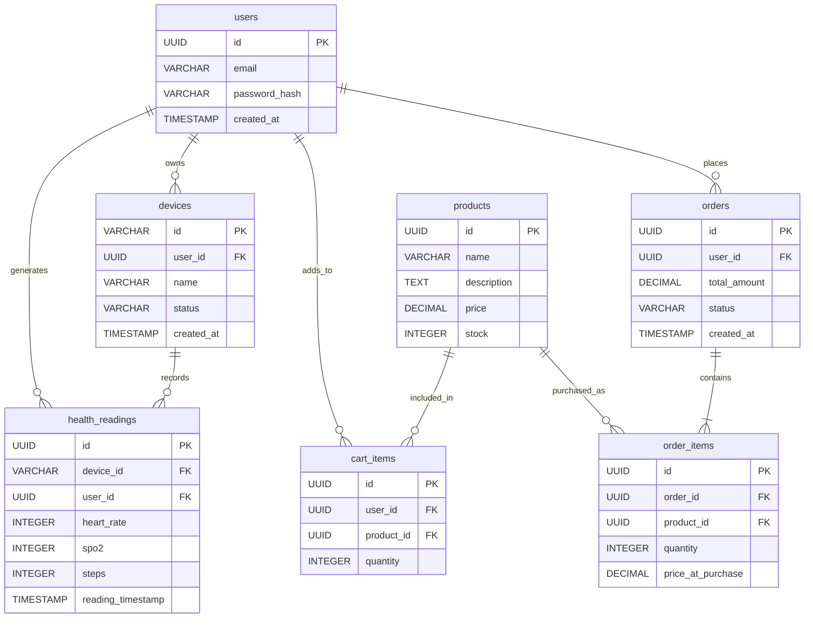

```mermaid
erDiagram
    users ||--o{ devices : owns
    users ||--o{ health_readings : generates
    users ||--o{ cart_items : adds_to
    users ||--o{ orders : places

    devices ||--o{ health_readings : records

    products ||--o{ cart_items : included_in
    products ||--o{ order_items : purchased_as

    orders ||--|{ order_items : contains

    users {
        UUID id PK
        VARCHAR email
        VARCHAR password_hash
        TIMESTAMP created_at
    }

    devices {
        VARCHAR id PK
        UUID user_id FK
        VARCHAR name
        VARCHAR status
        TIMESTAMP created_at
    }

    health_readings {
        UUID id PK
        VARCHAR device_id FK
        UUID user_id FK
        INTEGER heart_rate
        INTEGER spo2
        INTEGER steps
        TIMESTAMP reading_timestamp
    }

    products {
        UUID id PK
        VARCHAR name
        TEXT description
        DECIMAL price
        INTEGER stock
    }

    cart_items {
        UUID id PK
        UUID user_id FK
        UUID product_id FK
        INTEGER quantity
    }

    orders {
        UUID id PK
        UUID user_id FK
        DECIMAL total_amount
        VARCHAR status
        TIMESTAMP created_at
    }

    order_items {
        UUID id PK
        UUID order_id FK
        UUID product_id FK
        INTEGER quantity
        DECIMAL price_at_purchase
    }
```