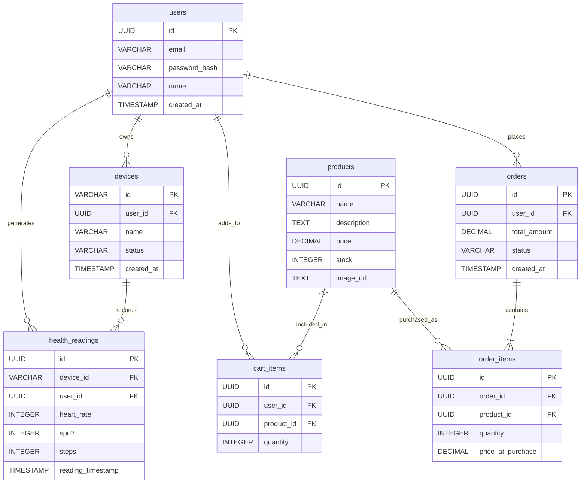

# Wearable Health & Shopping API

Backend for the *Wearable Health & Shopping* mobile app (ERBrains take-home assignment).
Node.js + Express + PostgreSQL.

## Architecture

**MVC**, applied plainly — no framework magic, no layer that isn't earning
its keep at this size:

```
server.js       -> loads env vars, starts the HTTP listener
app.js          -> Express app: middleware + route mounting (exported, no listen())
routes/         -> thin wiring only — path -> controller function, nothing else
controllers/    -> Model  (Controller = HTTP concern: parse req, validate,
                    pick a status code, call the model, shape the response)
models/         -> Model layer — one file per resource, owns all SQL for
                    that resource. Never touches req/res.
middleware/     -> auth.js: verifies the bearer token and exposes req.auth
utils/          -> small stateless helpers shared across layers (password.js)
db.js           -> pg Pool wrapper (query + transaction helper) — the only
                    file that talks to `pg` directly; every model goes through it
database/       -> schema.sql, seed.sql and the Node scripts that run them
tests/          -> Jest + Supertest, route logic tested against a mocked db module
```

There's no "View" layer in the template-rendering sense — this is a JSON
API, so the controller's `res.json(...)` call **is** the view, same as any
REST service following MVC. A request flows in one direction only:
`routes → controllers → models → db.js` — a model never calls a
controller, and a controller never runs SQL directly. That rule is what
keeps `models/*.js` reusable and independently testable in principle
(today they're exercised indirectly through the controller tests, via the
mocked `db` module).

**Why this split and not a heavier one** (e.g. a services layer between
controllers and models, or repository interfaces): every controller
action here is *one* HTTP request mapped to *one* piece of business logic,
and that logic already lives naturally in the model that owns the SQL for
it (see `order.model.js`'s `createFromCart` — the checkout transaction is
"business logic," and it's exactly as much model code as fetching a row
is). Adding a services layer would mean most service methods forward
straight through to a model method with no logic of their own — the kind
of indirection the assignment's own "avoid unnecessary complexity"
guidance is warning against.

`app.js` is separated from `server.js` specifically so it can be `require`d by tests
without opening a real port or needing a live database.

## Setup

```bash
npm install
cp .env.example .env   # or edit the existing .env — see variables below
npm run db:migrate     # creates tables (idempotent, safe to re-run)
npm run db:seed        # inserts sample data (see below)
npm start               # http://localhost:3000
```

`npm run db:seed` ([`database/seed.js`](database/seed.js)) populates enough data to exercise the whole
API immediately, without placing calls by hand first:

- 5 sample products, each with a placeholder `image_url` ([`database/seed.sql`](database/seed.sql))
- a demo user — `demo@erbrains.io` / `password123` / name "Jordan Lee" — log in with `POST /auth/login`
- a demo device (`FITRING-001`) owned by that user
- ~3 days of health readings at 15-minute intervals, so `/health/readings` and
  `/health/summary` have something to return right away
- one completed order, so `/orders` isn't empty on first call

It's idempotent — re-running it won't duplicate the user, device, readings, or order.

Environment variables (`.env`):

| Variable      | Purpose                        |
|---------------|---------------------------------|
| `PORT`        | HTTP port (default 3000)        |
| `DB_USER`     | PostgreSQL user                 |
| `DB_HOST`     | PostgreSQL host                 |
| `DB_NAME`     | Database name                   |
| `DB_PASSWORD` | PostgreSQL password              |
| `DB_PORT`     | PostgreSQL port (default 5432)  |

## Tests

```bash
npm test
```

Route handlers are tested against a mocked `db` module (no live database required),
covering the areas most likely to cause data loss or incorrect business results:

- **Auth middleware**: missing/malformed tokens rejected with `401`, a token whose
  `userId` doesn't match the requested resource rejected with `403`, public routes
  (`/auth/login`, `GET /products*`) reachable with no token at all.
- **Health readings**: request validation, and duplicate-skip counting for the
  `ON CONFLICT (device_id, reading_timestamp) DO NOTHING` sync path.
- **Cart**: validation, quantity merging via `ON CONFLICT (user_id, product_id)`, and
  the `PATCH`/`DELETE` endpoints' ownership check (scoped to `user_id`, not just `:id`).
- **Orders**: rejecting checkout on an empty cart, the full checkout transaction
  (cart snapshot → order + order_items → cart cleared) via the mocked `db.transaction`,
  and the `item_count` aggregate on `GET /orders`.

## Database



The runnable version of this schema is [`database/schema.sql`](database/schema.sql). Notable
constraints beyond the diagram:

- `health_readings` has `UNIQUE (device_id, reading_timestamp)` — this is what makes
  `POST /health/readings` idempotent: re-uploading the same reading after a failed sync
  is a no-op instead of a duplicate row.
- `cart_items` has `UNIQUE (user_id, product_id)` — `POST /cart` upserts onto this,
  incrementing quantity instead of creating a second line item for the same product.
- `products.name` is `UNIQUE` — that's what makes `database/seed.sql`'s
  `ON CONFLICT (name) DO NOTHING` an actual no-op on re-seed instead of duplicating rows.
- Foreign keys cascade on delete (e.g. deleting a user cleans up their devices, readings,
  cart items and orders).
- `schema.sql` ends with a few `ALTER TABLE ... ADD COLUMN IF NOT EXISTS` / guarded
  `ADD CONSTRAINT` statements so `npm run db:migrate` stays safe to re-run against a
  database that was created before `users.name` / `products.image_url` existed.

## API Documentation

All endpoints accept/return JSON. Errors are `{ "error": "..." }` with a 4xx/5xx status.

**Auth:** every route below except `POST /auth/login` and the two `GET /products` routes
requires `Authorization: Bearer <token>` (the token `POST /auth/login` returns). Routes
that also take a `userId` in the body/query additionally verify it matches the token's
`userId` — a valid token for one user can't read or act on another user's data. See
[middleware/auth.js](middleware/auth.js).

### Auth (public)
| Method | Path | Body | Notes |
|---|---|---|---|
| POST | `/auth/login` | `{ email, password, name? }` | Creates the user on first login (local-dev auth; `name` is optional and only used on creation), otherwise verifies the password hash. Returns `{ token, user: { id, email, name } }`. |

### Devices (auth required)
| Method | Path | Body / Query | Notes |
|---|---|---|---|
| POST | `/devices` | `{ deviceId, name, userId }` | Upserts by `deviceId`, marks it `connected`. |
| GET | `/devices?userId=` | — | Lists devices for a user. |

### Health data (auth required)
| Method | Path | Body / Query | Notes |
|---|---|---|---|
| POST | `/health/readings` | `{ userId, readings: [{ deviceId, heartRate, spo2, steps, timestamp }] }` | Batch upload. Returns `{ synced, duplicatesSkipped }`. Safe to retry — duplicates are skipped via the DB unique constraint, not client-side de-duplication. |
| GET | `/health/readings?userId=&page=&limit=` | — | Paginated, `limit` capped at 100 so the UI never has to render an unbounded page. |
| GET | `/health/summary?userId=&period=daily\|weekly` | — | Aggregated min/max/avg heart rate, avg/min SpO₂, and total steps over the last 7 days, bucketed by day or week — this is what backs the History screen's charts instead of shipping raw rows to the client. |

### Shopping — catalog (public)
| Method | Path | Notes |
|---|---|---|
| GET | `/products` | Full catalog, including each product's `image_url`. |
| GET | `/products/:id` | 404 if not found. |

### Shopping — cart & orders (auth required)
| Method | Path | Body / Query | Notes |
|---|---|---|---|
| POST | `/cart` | `{ userId, productId, quantity }` | Adds a line item, or increments its quantity if one already exists for that product. |
| GET | `/cart?userId=` | — | Items + computed `totalAmount`. |
| PATCH | `/cart/:id` | `{ quantity }` | Sets the line item to an exact quantity (the decrement counterpart to `POST /cart`'s increment-only upsert). 404 if `:id` isn't a cart item owned by the caller. |
| DELETE | `/cart/:id` | — | Removes the line item. 204 on success, 404 if not owned by the caller. |
| POST | `/orders` | `{ userId }` | Converts the current cart into an order inside a single DB transaction (snapshot prices into `order_items`, then empty the cart). 400 if the cart is empty. |
| GET | `/orders?userId=` | — | Order history, each row including an `item_count` aggregated from `order_items`. |

A ready-to-import collection is in [`Wearable-Health-API.postman_collection.json`](Wearable-Health-API.postman_collection.json)
(regenerate with `generate-postman.ps1`). Run **POST /auth/login** first — its test script
populates the collection's `{{token}}` and `{{userId}}` variables that every other request uses.

## Error handling

- **Validation** (missing/invalid fields): `400` before any DB call is made.
- **Foreign key violations** (Postgres code `23503`, e.g. unknown `userId`): mapped to `400`.
- **Duplicate health readings**: not an error — `ON CONFLICT DO NOTHING` + a `duplicatesSkipped`
  count in the response, so a retried sync batch is idempotent.
- **Checkout on an empty cart**: `400` with `"Cart is empty"`, raised before the transaction
  commits anything.
- **Unexpected/DB errors**: `500` with a generic message; the real error is logged server-side,
  never leaked to the client.
- **Auth failure**: wrong password on an existing email returns `401`, as does a missing or
  malformed bearer token on any protected route.
- **Acting on behalf of another user**: a valid token whose `userId` doesn't match the
  `userId` in the request body/query returns `403`.
- **Cart item not owned by the caller**: `PATCH`/`DELETE /cart/:id` return `404` rather than
  `403` when `:id` doesn't resolve to a row owned by `req.auth.userId` — this avoids
  confirming to a caller that a given cart-item id exists at all.

## Major technical decisions

- **No ORM.** Raw parameterized SQL via `pg` — the query surface is small enough that an ORM
  would add indirection without buying much, and it keeps the upsert/`ON CONFLICT` logic
  (which is load-bearing for duplicate prevention) explicit and easy to reason about.
- **Transactions for checkout only.** `POST /orders` is the one place multiple writes must
  succeed or fail together (order + order_items + cart clear); everything else is single-statement.
- **Mock auth, not JWT.** The assignment allows mock authentication; the token is an opaque
  base64 blob, not meant to be a production auth scheme. `middleware/auth.js` decodes and
  trusts it (there's no signature to verify) — swapping in signed JWTs later only touches
  that one file plus `auth.controller.js`; no route or model changes.
- **Ownership checks live in the controllers (`ensureSelf`), not just the middleware.**
  `requireAuth` only proves *who's asking*; each controller action still decides whether
  that identity is allowed to touch the specific `userId`/row in the request. Keeping that
  explicit per action (rather than inferring it generically) is what makes
  `PATCH`/`DELETE /cart/:id` scope their `WHERE` clause (in `cart.model.js`) to
  `user_id = req.auth.userId` instead of trusting `:id` alone.
- **`app.js` / `server.js` split** exists purely for testability (see Architecture above).
- **models/controllers/routes over one flat `app.js`.** The route handlers started inline in
  `app.js`; moved to explicit MVC layers so each piece is independently readable/testable —
  `models/*.js` never sees an HTTP request, `controllers/*.js` never writes SQL. Pure refactor:
  every SQL string, status code and response shape is unchanged, which is why the existing
  33 tests needed zero edits.
- **`products.image_url` points at placeholder images** (`placehold.co`), not real product
  photography — there isn't any for this project. Swap the seed data for real asset URLs
  whenever it exists; no schema change needed.
