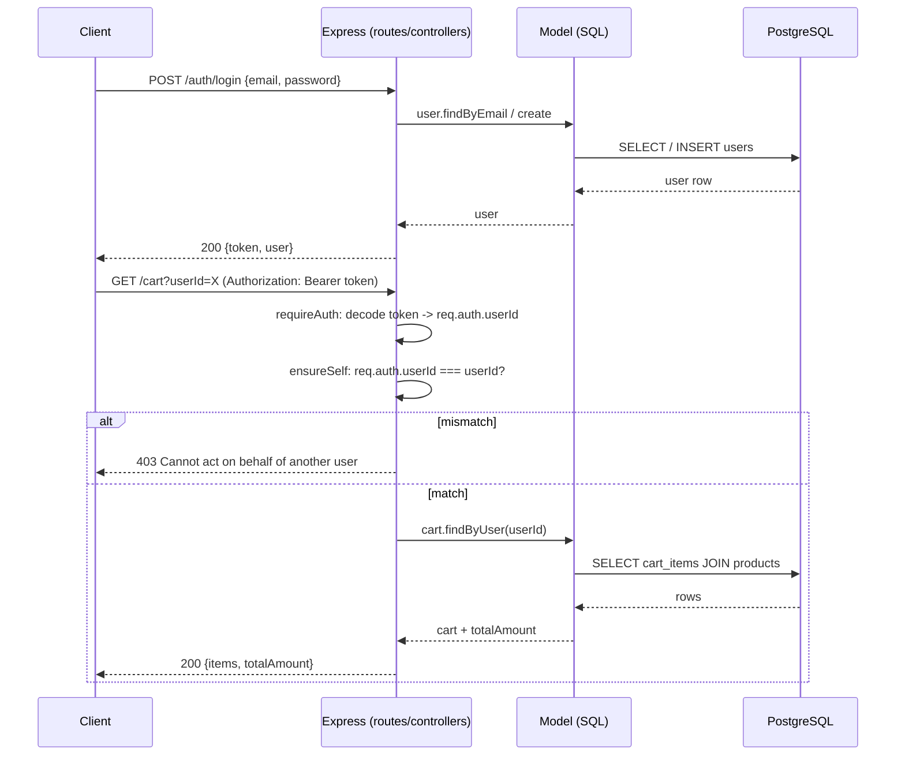

# API reference

Base URL: `http://localhost:3000` (see [`../api/README.md`](../api/README.md#setup)
for running it locally). All endpoints accept/return JSON. Errors are
`{ "error": "..." }` with a 4xx/5xx status — see
[ARCHITECTURE.md#error-handling](ARCHITECTURE.md#error-handling).

## Auth model

Every route below except `POST /auth/login` and the two `GET /products`
routes requires `Authorization: Bearer <token>`, where `<token>` is the
value `POST /auth/login` returns. The token is an opaque, unsigned
base64-encoded blob (`{ userId, email, issuedAt }`) — see
[DECISIONS.md](DECISIONS.md#backend) for why mock auth rather than JWT was
chosen for this assignment.

Routes that also take a `userId` in the body/query verify it matches the
token's `userId` — a valid token for one user cannot read or act on
another user's data. Enforced by `requireAuth` (identity) +
`ensureSelf`/per-controller ownership checks (authorization) — see
[`../api/middleware/auth.js`](../api/middleware/auth.js) and
[ARCHITECTURE.md](ARCHITECTURE.md#backend-request-flow).



## Auth (public)

| Method | Path | Body | Notes |
|---|---|---|---|
| POST | `/auth/login` | `{ email, password, name? }` | Creates the user on first login (local-dev auth; `name` optional, only used on creation), otherwise verifies the password hash. Returns `{ token, user: { id, email, name } }`. |

## Devices (auth required)

| Method | Path | Body / Query | Notes |
|---|---|---|---|
| POST | `/devices` | `{ deviceId, name, userId }` | Upserts by `deviceId`, marks it `connected`. |
| GET | `/devices?userId=` | — | Lists devices for a user. |

## Health data (auth required)

| Method | Path | Body / Query | Notes |
|---|---|---|---|
| POST | `/health/readings` | `{ userId, readings: [{ deviceId, heartRate, spo2, steps, timestamp }] }` | Batch upload. Returns `{ synced, duplicatesSkipped, results }`, where `results` is one `{ deviceId, timestamp, status: "synced" \| "duplicate" }` entry per input reading, same order — lets the client attribute outcome per reading instead of trusting the whole batch synced uniformly. Safe to retry — duplicates skipped via the DB unique constraint (see [DATABASE.md](DATABASE.md)), not client-side dedup. |
| GET | `/health/readings?userId=&page=&limit=` | — | Paginated, `limit` capped at 100. |
| GET | `/health/summary?userId=&period=daily\|weekly` | — | Aggregated min/max/avg heart rate, avg/min SpO₂, total steps over the last 7 days, bucketed by day or week — backs the History screen's charts server-side instead of shipping raw rows to the client. |

## Shopping — catalog (public)

| Method | Path | Notes |
|---|---|---|
| GET | `/products` | Full catalog, including each product's `image_url`. |
| GET | `/products/:id` | 404 if not found. |

## Shopping — cart & orders (auth required)

| Method | Path | Body / Query | Notes |
|---|---|---|---|
| POST | `/cart` | `{ userId, productId, quantity }` | Adds a line item, or increments quantity if one already exists for that product (upsert on `UNIQUE (user_id, product_id)`). |
| GET | `/cart?userId=` | — | Items + computed `totalAmount`. |
| PATCH | `/cart/:id` | `{ quantity }` | Sets the line item to an exact quantity — the decrement counterpart to `POST /cart`'s increment-only upsert. 404 if `:id` isn't a cart item owned by the caller. |
| DELETE | `/cart/:id` | — | Removes the line item. 204 on success, 404 if not owned by the caller. |
| POST | `/orders` | `{ userId }` | Converts the current cart into an order inside a single DB transaction (snapshot prices into `order_items`, then empty the cart). 400 if the cart is empty. |
| GET | `/orders?userId=` | — | Order history, each row including an `item_count` aggregated from `order_items`. |

## Worked example

```bash
# 1. Login — returns a token scoped to this user
curl -X POST http://localhost:3000/auth/login \
  -H "Content-Type: application/json" \
  -d '{"email":"demo@erbrains.io","password":"password123"}'
# -> { "token": "eyJ1c2Vy...", "user": { "id": "12b8...", "email": "...", "name": "Jordan Lee" } }

# 2. Authenticated request — userId must match the token's userId
curl http://localhost:3000/cart?userId=12b8... \
  -H "Authorization: Bearer eyJ1c2Vy..."

# 3. Requesting a userId that doesn't match the token's -> 403 before any DB call
# { "error": "Cannot act on behalf of another user" }
```

A ready-to-import Postman collection is at
[`../api/Wearable-Health-API.postman_collection.json`](../api/Wearable-Health-API.postman_collection.json)
(regenerate with `../api/generate-postman.ps1`). Run **POST /auth/login**
first — its test script populates the collection's `{{token}}` and
`{{userId}}` variables that every other request uses.

## Client consumption (Flutter)

`flutter/lib/core/data/datasources/remote/api_client.dart` is a 1:1 wrapper
around this API — one method per route above. A Dio interceptor attaches
`Authorization: Bearer <token>` from `TokenStorage` to every outgoing
request automatically; screens/controllers never touch the header
directly. See [ARCHITECTURE.md](ARCHITECTURE.md#flutter-request-flow).
