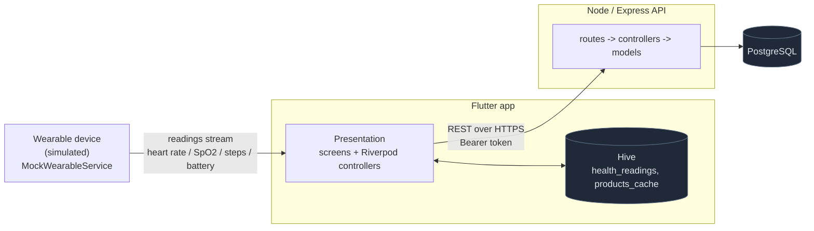
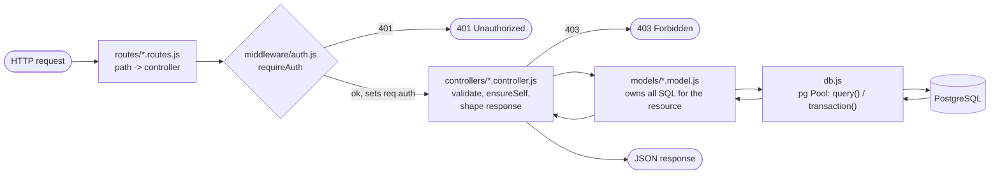
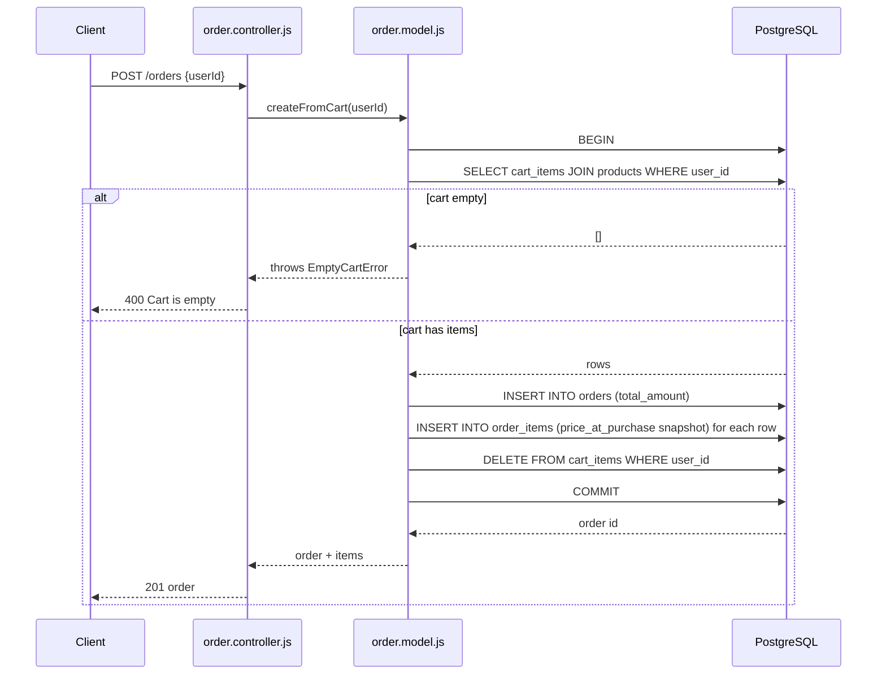
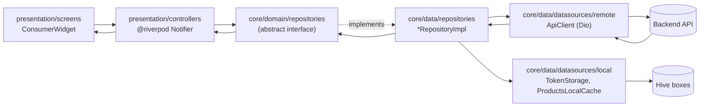

# Architecture

System-level and per-project architecture for the Wearable Health &
Shopping app: an Express/PostgreSQL API and a Flutter client, talking over
REST, with a simulated wearable feeding the client.

## System context



The wearable is a device abstraction (`WearableService`), not a network
peer of the backend — its data reaches the API only after passing through
the client's local store and sync engine. See
[OFFLINE_SYNC.md](OFFLINE_SYNC.md) and
[WEARABLE_INTEGRATION.md](WEARABLE_INTEGRATION.md).

---

## Backend

MVC, applied without a "View" layer — a JSON API has no templates to
render; the response body *is* the view.

```
api/
  server.js       -> loads env vars, starts the HTTP listener
  app.js          -> Express app: middleware + route mounting (exported, no listen())
  routes/         -> thin wiring only — path -> controller function, nothing else
  controllers/    -> parses the request, validates it, picks a status code,
                      calls the model, shapes the JSON response
  models/         -> one file per resource, owns all SQL for that resource.
                      Never touches req/res — doesn't know an HTTP request exists.
  middleware/     -> auth.js: verifies the bearer token and exposes req.auth
  utils/          -> small stateless helpers shared across layers (password.js)
  db.js           -> pg Pool wrapper (query + transaction helper) — the only
                      file that talks to the `pg` package directly; every
                      model goes through it instead of connecting itself
  database/       -> schema.sql, seed.sql and the Node scripts that run them
  tests/          -> Jest + Supertest, route logic tested against a mocked db module
```

### Backend request flow



Flow is strictly unidirectional: `routes → controllers → models → db.js`.
A model never calls a controller; a controller never runs SQL directly.
That constraint keeps `models/*.js` independently testable and reusable —
currently exercised indirectly through controller tests via a mocked `db`
module (see [`../api/README.md#tests`](../api/README.md#tests)).

**No services layer.** Every controller action here is one HTTP request
mapped to one piece of business logic, and that logic already lives in the
model that owns the relevant SQL — see `order.model.js`'s
`createFromCart`, where the entire checkout transaction (cart → order +
order_items → cleared cart) is model code, not a separate service. See
[DECISIONS.md](DECISIONS.md#backend) for the full reasoning.

**Ownership checks (`ensureSelf`) live in controllers, not just
middleware.** `requireAuth` only proves identity; it has no notion of what
a "cart" or "order" is. Each controller separately decides whether that
identity may act on the specific resource in the request — see the
sequence diagram in [API.md](API.md#auth-model).

`app.js` is split from `server.js` purely for testability: it's
`require`d by the test suite without opening a network port or needing a
live database.

### Checkout transaction

The one place multiple writes must commit or roll back as a unit:



---

## Flutter

Clean Architecture (domain / data / presentation), applied pragmatically —
see [Deliberate departures](#deliberate-departures-from-textbook-clean-architecture)
below for what was left out and why.

```
flutter/lib/
  design_system/            Nocturne design tokens + primitives (button, card, tag, ...) — the
                             shared visual vocabulary every screen (View) is built from.

  core/
    domain/
      entities/               Plain data classes: AppUser, Product, Cart, Order,
                               Device, HealthReading, HealthSummaryPoint. No
                               Flutter/Dio/Hive imports — pure Dart.
      repositories/           Abstract contracts: AuthRepository, DeviceRepository,
                               ProductRepository, CartRepository, OrderRepository.
                               Presentation code depends on these, never on a
                               concrete impl or on ApiClient directly.

    data/
      datasources/
        remote/                ApiClient + ApiException — one method per backend
                                endpoint, the only place that speaks HTTP.
        local/                 TokenStorage, ProductsLocalCache — Hive-backed,
                                the only place that reads/writes those boxes.
      repositories/             *Impl classes satisfying the domain contracts,
                                each composing one or more datasources
                                (e.g. ProductRepositoryImpl = ApiClient +
                                ProductsLocalCache + the cache-first policy).

    health_sync/               HealthReadingLocalStore, SyncManager, HealthSyncEngine
                                — the reading offline queue. Deliberately *not* squeezed
                                into the repository shape above; see below.
    cart_sync/                 CartSyncStore, CartSyncManager, effective_cart.dart — the
                                cart/order offline queue, structurally mirroring
                                health_sync/ but single-mutation-at-a-time rather than
                                batched. See OFFLINE_SYNC.md#cartorder-offline-queue.
    background/                BackgroundSync (workmanager) — OS-level periodic drain
                                of both queues above, independent of the app's UI
                                isolate being alive. See OFFLINE_SYNC.md#background-sync.
    wearable/                  WearableService interface + MockWearableService —
                                see WEARABLE_INTEGRATION.md.
    offline/                   ConnectivityMonitor, CachePolicy, Hive box setup, LocalDataWiper
    providers/                 The composition root: datasource_providers.dart wires
                                the data sources, repository_providers.dart wires
                                domain-typed repositories on top of them.

  features/<name>/presentation/
    controllers/              The Controller/ViewModel layer — Riverpod notifiers
                               and providers, one per feature, depending only on
                               core/domain/repositories (never ApiClient/Hive directly).
    screens/                  The View layer — one file per screen.
    widgets/                  Feature-local presentational widgets (charts, tab bar, ...).

  app.dart, main.dart        Entry point, theme, ProviderScope
```

### Flutter request flow



Screens and controllers depend only on the abstract `core/domain/
repositories` interfaces, never on `ApiClient` or Hive directly — swapping
the backend (e.g. Postgres/Express → Firebase) touches only `core/data/`.

**MVC and Riverpod aren't in tension.** The classic Controller's job —
receive an intent, decide what changes, hand the View new state — is what
a Riverpod `Notifier` does here. A separate hand-rolled Controller class
delegating straight to a Notifier would be a pass-through layer with no
logic of its own — the same unnecessary indirection the assignment's
"avoid unnecessary complexity" guidance warns against. So: **Model =
`core/domain/entities`, View = `presentation/screens` + `presentation/
widgets`, Controller = `presentation/controllers`** (Riverpod notifiers/
providers) — MVC roles, Riverpod idioms.

**State management: Riverpod, generator-based (`@riverpod`), not
Bloc/Cubit or plain `ChangeNotifier`.** Providers are annotated
functions/classes over immutable state (`copyWith`), composed by reading
each other (`ref.watch`) rather than constructor injection. Every provider
file has a generated `*.g.dart` sibling — run
`dart run build_runner build --delete-conflicting-outputs` after touching
provider signatures. Zero `setState` anywhere in the app — all UI state,
including things like the bottom-tab index and the product-quantity
stepper, is Riverpod state (`ShellTabIndex`, `ProductQuantity`).

### Deliberate departures from textbook Clean Architecture

Two layers a by-the-book implementation would add, omitted because they'd
carry no logic of their own:

- **No `UseCase` class per operation.** A `LoginUseCase` that does nothing
  but call `authRepository.login(...)` is a pass-through — the controller
  calling the repository directly *is* the use case here, same reasoning
  as the backend's "no services layer" decision.
- **The offline engine (`core/health_sync/`) isn't wrapped in a
  `HealthRepository`.** `SyncManager` and `HealthReadingLocalStore` already
  provide a purpose-built interface — batched drain, retry/backoff, live
  counts via streams. Forcing that into a generic `Future<List<Entity>>
  get(id)`-shaped repository would lose exactly the vocabulary (`drain()`,
  `pendingCount`, `retryFailed()`) that makes [OFFLINE_SYNC.md](OFFLINE_SYNC.md)'s
  design legible. `SyncManager` *is* this subsystem's repository-
  equivalent, just named for what it does. It does depend on
  `DeviceRepository` for device registration
  (`core/health_sync/health_sync_providers.dart`) — the one place these
  two subsystems meet.
- **Same reasoning for `core/cart_sync/` — `CartRepository` is read-only.**
  `CartRepository.get()` remains (a plain fetch has no queue-specific
  vocabulary to lose), but `add`/`setQuantity`/`remove` were *removed*
  from it once the offline queue existed — `CartSyncManager` calls
  `ApiClient` directly for those, the same way `SyncManager` does for
  readings. A `CartRepository.add()` that just forwarded to
  `CartSyncStore.enqueue()` would be exactly the pass-through this section
  is about avoiding.

---

## Error handling

| Situation | Backend | Flutter client |
| --- | --- | --- |
| Validation failure | `400` before any DB call | Surfaced via `ApiException` |
| Foreign key violation (Postgres `23503`) | Mapped to `400` | Same |
| Duplicate health reading | Not an error — `ON CONFLICT DO NOTHING`, and now reported per-reading in `results` (see [API.md](API.md)) | Reconciled precisely (`SyncStatus.duplicate` vs. `synced`), not just absorbed into a blanket "batch succeeded" — see [OFFLINE_SYNC.md](OFFLINE_SYNC.md#reading-conflict-resolution) |
| Checkout on empty cart | `400 "Cart is empty"`, raised before the transaction commits | Same retry/backoff path as any other queued mutation, surfaced as "queued" rather than a synchronous error — see [OFFLINE_SYNC.md](OFFLINE_SYNC.md#cartorder-offline-queue) |
| Auth failure | `401` (bad password / missing or malformed token) | Login form shows the error; no silent-logout-on-401 interceptor — a session gone stale mid-use surfaces on the next action rather than force-navigating to Login |
| Acting on behalf of another user | `403` before any DB call | N/A — client always sends its own `userId` |
| Cart item not owned by caller | `PATCH`/`DELETE /cart/:id` return `404`, not `403` — avoids confirming the id exists at all | Surfaced as a normal `ApiException` |
| Unexpected/DB error | `500`, generic message, real error logged server-side | `DioException` without a response resolves to a generic `ApiException`, never an uncaught exception reaching the UI |
| Bluetooth/device disconnect | N/A | Auto-reconnect with backoff → `connectionFailed` after 4 attempts → manual "Reconnect now" always available. See [WEARABLE_INTEGRATION.md](WEARABLE_INTEGRATION.md). |
| No internet | N/A | Reads fall back to local data (History: always; Products: cache-first, 7-day grace; Cart: last-known baseline). Health-reading and cart/order writes both queue rather than failing — see [OFFLINE_SYNC.md](OFFLINE_SYNC.md). |
| Failed sync | N/A | Per-item retry/backoff, surfaced in `SyncBanner`/`CartSyncBanner`. See [OFFLINE_SYNC.md](OFFLINE_SYNC.md). |
| App killed / fully backgrounded | N/A | In-app drain triggers stop; a `workmanager`-backed OS task can still drain both queues periodically — best-effort, not guaranteed timing, and its real-device execution is unverified in this build. See [OFFLINE_SYNC.md#background-sync](OFFLINE_SYNC.md#background-sync). |
