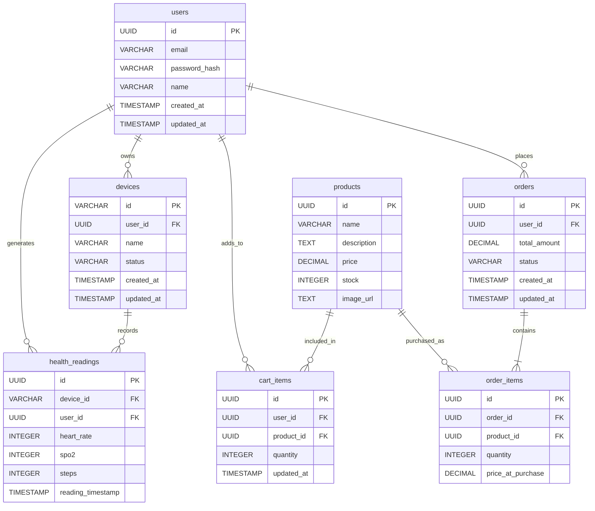

# Database design

Single PostgreSQL database, owned entirely by the API (`api/`). The Flutter
client has no direct database access — it only ever sees this schema
through the REST API in [API.md](API.md). The client's local Hive storage
is a separate, unrelated concern; see
[OFFLINE_SYNC.md](OFFLINE_SYNC.md#queue-persistence-and-idempotency).

Runnable baseline schema: [`../api/database/schema.sql`](../api/database/schema.sql).
Tracked schema evolution since the baseline: [`../api/database/migrations/`](../api/database/migrations).
Seed data: [`../api/database/seed.sql`](../api/database/seed.sql) /
[`../api/database/seed.js`](../api/database/seed.js).

## Design notes

**`order_items` as the orders↔products join table.** An order can contain
several products and a product can appear on several orders — a
many-to-many the schema resolves with a connector table, one row per
(order, product) pairing.

**`order_items.price_at_purchase` snapshots price at transaction time**
rather than joining live to `products.price`. An order placed today must
keep showing what was actually paid if the catalog price changes later —
this is the standard "snapshot at the moment of the transaction" pattern
for anything that represents a historical fact rather than current state.

**`orders.status` is a real lifecycle, not a fixed value.** `pending` →
`completed` (checkout succeeds instantly — there's no real payment
gateway to wait on) or → `cancelled` (via `POST /orders/:id/cancel`,
which restores the stock the order reserved). `cancelled` is the only
terminal state; a `completed` order can still be cancelled since this app
has no fulfillment step that would make that unsafe. Enforced by
`CHECK (status IN ('pending', 'completed', 'cancelled'))` — see migration
001 below.

**Idempotency and concurrency safety are pushed into the database, not
application code:**

| Constraint / technique | Enables |
|---|---|
| `health_readings UNIQUE (device_id, reading_timestamp)` | `POST /health/readings` is safe to retry — a replayed sync batch after a dropped response is a no-op via `ON CONFLICT DO NOTHING`, not a duplicate row. No client-side dedup logic exists or is needed. |
| `cart_items UNIQUE (user_id, product_id)` | `POST /cart` upserts on this constraint, incrementing quantity instead of creating a second line item for the same product in the same cart. |
| `products.name UNIQUE` | `database/seed.sql`'s `ON CONFLICT (name) DO NOTHING` makes re-seeding an actual no-op instead of duplicating the catalog. |
| `SELECT ... FOR UPDATE OF p` in checkout | Locks the specific `products` rows a checkout is about to decrement stock on, for the transaction's duration — two concurrent checkouts racing for the last unit of the same product get serialized instead of both reading "enough stock" and both succeeding (a classic lost-update bug a plain read-then-write would have). See `order.model.js#createFromCart`. |

**Foreign keys cascade on delete** — deleting a user cascades to their
devices, readings, cart items, and orders. There is no soft-delete /
`deleted_at` column anywhere in this schema; out of scope for the
assignment.

**`updated_at` + trigger, not just `created_at`.** `users`, `devices`,
`cart_items`, and `orders` each have a `set_updated_at()` trigger
(`BEFORE UPDATE`) so `updated_at` reflects the actual last write instead
of silently staying at insert time — a `DEFAULT NOW()` column alone only
sets the value once, at creation.

**Migration strategy: tracked migrations layered on the original
idempotent baseline, not a framework swap.** `schema.sql` is still applied
in full every run via guarded DDL (`CREATE TABLE IF NOT EXISTS`,
`ADD COLUMN IF NOT EXISTS`) — sufficient for a single-environment
take-home, and there's no reason to disturb something that already works.
Schema changes *since* that baseline (the `updated_at` columns and the
`orders.status` lifecycle above) go through numbered files in
`database/migrations/`, applied once each and recorded in a
`schema_migrations` table by `database/migrate.js` — a lightweight,
hand-rolled evolution of the same idempotent approach rather than a
wholesale move to Flyway/Knex/Prisma migrate, which would be
disproportionate at this project's size. CI applies both the baseline and
every migration against a real, ephemeral Postgres on every push (see
[`../.github/workflows/ci.yml`](../.github/workflows/ci.yml)), which is
also what catches a syntax error in either that a mocked-`db` unit test
never would.
