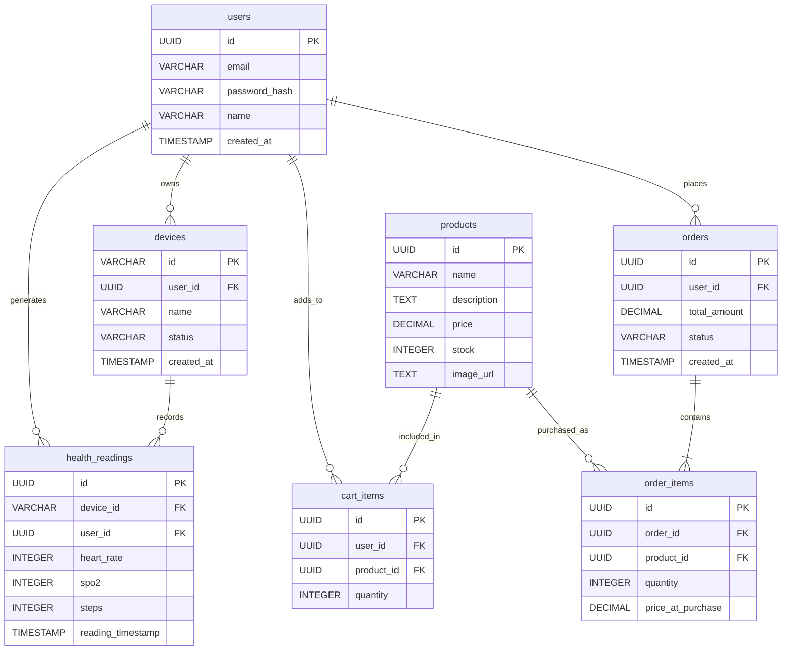

# Database design

Single PostgreSQL database, owned entirely by the API (`api/`). The Flutter
client has no direct database access — it only ever sees this schema
through the REST API in [API.md](API.md). The client's local Hive storage
is a separate, unrelated concern; see
[OFFLINE_SYNC.md](OFFLINE_SYNC.md#queue-persistence-and-idempotency).

Runnable schema: [`../api/database/schema.sql`](../api/database/schema.sql).
Seed data: [`../api/database/seed.sql`](../api/database/seed.sql) /
[`../api/database/seed.js`](../api/database/seed.js).

## Design notes

**`order_items` as the orders↔products join table.** An order can contain
several products and a product can appear on several orders — a
many-to-many the schema resolves with a connector table, one row per
(order, product) pairing.

**`order_items.price_at_purchase` snapshots price at transaction time**
rather than joining live to `products.price`. An order placed today must
keep showing what was actually paid if the catalog price changes later —
this is the standard "snapshot at the moment of the transaction" pattern
for anything that represents a historical fact rather than current state.

**Idempotency is pushed into unique constraints, not application code:**

| Constraint | Enables |
|---|---|
| `health_readings UNIQUE (device_id, reading_timestamp)` | `POST /health/readings` is safe to retry — a replayed sync batch after a dropped response is a no-op via `ON CONFLICT DO NOTHING`, not a duplicate row. No client-side dedup logic exists or is needed. |
| `cart_items UNIQUE (user_id, product_id)` | `POST /cart` upserts on this constraint, incrementing quantity instead of creating a second line item for the same product in the same cart. |
| `products.name UNIQUE` | `database/seed.sql`'s `ON CONFLICT (name) DO NOTHING` makes re-seeding an actual no-op instead of duplicating the catalog. |

**Foreign keys cascade on delete** — deleting a user cascades to their
devices, readings, cart items, and orders. There is no soft-delete /
`deleted_at` column anywhere in this schema; out of scope for the
assignment.

**Migration strategy.** There's no migration framework (Flyway/Knex/
Prisma migrate) — `database/schema.sql` is applied idempotently via
guarded DDL (`CREATE TABLE IF NOT EXISTS`, `ADD COLUMN IF NOT EXISTS`,
conditionally-guarded `ADD CONSTRAINT`), which is sufficient for a
single-environment take-home project but wouldn't scale to a team needing
versioned, reversible migrations. See
[DECISIONS.md](DECISIONS.md#backend) for the trade-off reasoning.
