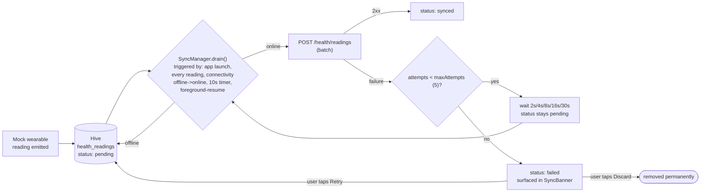

# Offline-first strategy

FitRing's starting point was the PDF's target scenario — *"the device
generates 100 readings while the phone has no internet; when internet
returns, sync those readings"* — and that workflow is fully built:
readings are captured to local storage the instant the mock wearable
emits them, queue and drain in order, survive app restarts, and surface
their state in a sync banner.

The engine has since grown two ways beyond that minimum. First,
**breadth**: cart adds/quantity changes/removals and order placement now
queue the same way readings do, instead of staying network-only (see
[Cart/order offline queue](#cartorder-offline-queue) below) — the original
"why so little is queued" reasoning is kept further down because it's
still exactly why *auth* has no offline path, and it's the reasoning that
shaped how the cart queue works once it *was* built. Second, **depth**:
the reading pipeline itself grew a staleness eviction sweep (bounding the
local store's otherwise-unlimited growth) and per-reading conflict
reconciliation (the client now knows precisely which readings the backend
accepted as new vs. recognized as duplicates, not just an aggregate
count). A true OS-level background sync task also now exists, so the
queues can drain even while the app is fully backgrounded or killed, not
only while it's open — see [Background sync](#background-sync) for what
that does and doesn't guarantee, and its verification status.

**Shipped:**
- **Local storage** — a single Hive box (`health_readings`) holding every
  reading the device has ever produced, synced or not. This IS the
  offline store the PDF's "Local Health Data" section asks for, not a
  cache of a server response — see `HealthReadingLocalStore`.
- **`CachePolicy` consultation** — cache-first, applied to the one other
  resource worth it: the product catalog (`GET /products`), which behaves
  like the reference philosophy's "near-static reference data" case. See
  `ProductsLocalCache` / `shop_controller.dart`.
- **`ConnectivityMonitor`** — thin wrapper over `connectivity_plus`
  exposing a current snapshot and an offline→online transition stream.
- **`SyncManager`** — drains pending readings to `POST /health/readings`
  in write-order batches, gated on an idempotent device registration
  (`POST /devices`) since `health_readings.device_id` is a foreign key.
  Triggered by: app launch (`HealthSyncEngine.start()`), every wearable
  reading (a drain attempt follows every write — see below), connectivity
  offline→online, a 10s periodic timer, and app-foreground-resume — all
  wired in `RootShell`.
- **Per-reading retry with backoff** — a failed batch increments every
  reading's attempt counter; readings under `maxAttempts` (default 5) stay
  `pending` for the next drain, readings that exhaust it move to `failed`
  and stop being auto-retried. Backoff (2s/4s/8s/16s/30s, keyed to the
  worst attempt count in the failed batch) blocks the next automatic
  attempt — see `SyncManager._scheduleRetry`.
- **Sync UI** — `SyncBanner` above every screen in `RootShell`: silent
  when the queue is empty, a quiet strip while pending, a tappable
  failed-state opening `SyncFailedSheet` with Retry (full attempt budget
  restored) / Discard (permanent — a real gap in that period's history,
  not a display filter). Screen 05 (`SyncStatusScreen`) shows the same
  state as a dedicated page.
- **History is fully offline** — `history_controller.dart` reads recent
  readings and computes daily/weekly summaries straight from the local
  store (`HealthReadingLocalStore.summary`, a client-side port of the
  backend's `GET /health/summary` SQL), not the network. It updates live
  as new readings are captured or synced, via the store's Hive `watch()`
  stream — no polling.
- **Sign-out full local wipe** — `LocalDataWiper` clears every Hive box
  (readings queue included), wired into `AuthNotifier.logout()`.
- **Proof** — `test/health_sync_manager_test.dart` drives `SyncManager`
  against fakes (no Hive-in-Flutter, no network): device-registration
  gating, per-reading attempt counting, the failed-state transition, and
  backoff actually blocking a too-soon retry, all pass.
- **Cart/order offline queue** — `add`/`setQuantity`/`remove`/`placeOrder`
  all queue through `CartSyncStore` + `CartSyncManager` instead of calling
  the backend directly, with local→real cart-item-id resolution and
  order placement gated behind every cart edit ahead of it. See
  [Cart/order offline queue](#cartorder-offline-queue).
- **Per-reading conflict reconciliation** — `POST /health/readings` now
  returns which specific readings were newly inserted vs. recognized as
  duplicates; the client marks each precisely (`SyncStatus.synced` vs.
  `SyncStatus.duplicate`) instead of assuming a successful batch means
  every reading in it was new. See [Reading conflict resolution](#reading-conflict-resolution).
- **Staleness eviction** — `HealthReadingLocalStore.evictSyncedOlderThan`
  deletes only `synced` readings past a 30-day retention window, run once
  per session in `HealthSyncEngine.start()`. Pending/failed readings are
  never touched by it.
- **OS-level background sync** — a `workmanager`-backed periodic task
  drains both queues even while the app is backgrounded or killed, not
  only while it's open. See [Background sync](#background-sync) —
  including its verification status, which is more limited than the rest
  of this list.

**Still not built** (unchanged from before, and still deliberate — see
[Why so little is queued](#why-so-little-is-queued) for cart/order's
specific case, and each item below for the rest):
- Any field-level conflict *merging* — every queue here resolves
  conflicts by "the backend's version wins, or the write is simply a
  duplicate," never by combining two divergent versions of the same
  record. See [Sync conflict handling](#sync-conflict-handling).
- 429/`Retry-After`-aware backoff — the sync endpoints these queues
  actually call (`POST /health/readings`, `POST /cart`, `POST /orders`,
  etc.) have no rate limiting to react to. `POST /auth/login` does now
  (see [DECISIONS.md](DECISIONS.md#backend)), but nothing in this app
  retries a login automatically, so there's still no automatic-retry loop
  anywhere that a `Retry-After` parser would need to inform. See
  [Why this app's shape is much smaller](#why-this-apps-shape-is-much-smaller-than-the-reference-philosophy).
- Auth has no offline path — see [Why so little is queued](#why-so-little-is-queued).

## Why this app's shape is much smaller than the reference philosophy

The philosophy this was built from (pasted in full in the session that
produced this doc) describes a multi-domain fitness app — workouts,
meals, progress, billing, a coach — with per-resource cache policies,
optimistic updates across half a dozen Blocs, and a generic
`PendingMutation` queue. FitRing has three domains (health readings,
device pairing, shopping) and one state-management stack decision
(Riverpod, not Bloc/Cubit — every `*Cubit`/`*Bloc` reference in the
source philosophy became a `Notifier`/provider here). Translating the
*philosophy* faithfully meant scaling the *implementation* down hard, not
copying file names. Concretely:

- **One `Box`, not one-per-resource-type.** The reference app's
  catalog/profile/session/billing spread justified separate boxes. This
  app has one resource that needs a real offline queue (readings) and one
  that benefits from a plain cache (products) — `health_readings` and
  `products_cache` are the only two boxes that exist.
- **A generic `PendingMutation` queue was replaced with a resource-
  specific store.** The reference doc's queue holds arbitrary
  method/path/body tuples because it queues many different endpoints.
  This app queues exactly one shape of write — a health reading — so
  `HealthReadingLocalStore` models that directly (with a `syncStatus`
  field) instead of wrapping it in a generic envelope that would only
  ever hold one variant.
- **No `PendingMutation.id` / client-minted UUIDs for readings.** The
  reference philosophy's idempotency section explicitly separates two
  patterns: client-minted ids (meals, sessions) vs. natural-key dedupe
  (weight entries, set logs). Health readings are the second kind — the
  backend already dedupes on `(device_id, reading_timestamp)` via
  `ON CONFLICT ... DO NOTHING` (see `api/database/schema.sql`) — so there
  was no client-id design left to make. `HealthReading.localId` exists
  purely as the Hive key and never appears in a request body.
- **No conflict (409) handling for readings specifically.** Following
  directly from the point above: `POST /health/readings` silently no-ops
  on a duplicate key rather than returning a conflict, so the reference
  doc's 409-and-404-as-"already applied" branch has nothing to attach to
  for this queue. (`POST /orders` *does* return `409` now, for
  insufficient stock — a genuinely different situation, where there's a
  real business conflict to report rather than a harmless duplicate. See
  [Cart/order offline queue](#cartorder-offline-queue).)
- **No 429/`Retry-After` handling for the reading queue.** `POST
  /health/readings` — the only endpoint `SyncManager` calls — has no rate
  limiting to react to (`POST /auth/login` does now, see
  [DECISIONS.md](DECISIONS.md#backend), but `SyncManager` never calls it).
  Building a `Retry-After` parser for a response this specific endpoint
  can't produce would be untested-by-construction dead code;
  `SyncManager`'s generic backoff covers "some request failed" uniformly
  instead.

## Why so little is queued

**This section is the original reasoning from when only health readings
queued.** Cart and orders queue now too (see
[Cart/order offline queue](#cartorder-offline-queue)) — the reasoning
below is kept because (a) it's still exactly why *auth* has no offline
path, unchanged, and (b) it's the reasoning that shaped *how* the cart
queue was eventually built, not something it made obsolete.

- **Readings are generated continuously and automatically** by the
  wearable simulation, arrive whether or not anyone's looking at the
  screen, and the PDF explicitly specifies the offline scenario for them
  (100 readings queued, synced on reconnect). This is the workflow where
  "started while offline, must not be lost" was a real product
  requirement from day one, not a nice-to-have added later.
- **Cart/order writes are user-initiated, in-the-moment actions**, and
  critically, the backend doesn't check stock at all today — `POST /cart`
  and `POST /orders` never read `products.stock` (see
  `api/models/cart.model.js`, `api/models/order.model.js`). That's *why*
  the cart queue could be built as "the backend's state always wins, no
  merge logic" rather than needing real conflict resolution: there's no
  stock-ran-out response to reconcile against, only genuine network
  failures and the ordinary "cart is empty" business error, both handled
  by the same retry/backoff every other queued write gets. If the backend
  ever grows stock validation, this reasoning — and the cart queue's
  design — would need revisiting; it isn't free of the reconciliation
  problem, it's just that the problem doesn't currently exist to solve.
- **Auth needs a live server by construction** — there's no offline
  login, and none is planned; a token has to come from somewhere real.

The natural-key pattern that makes the reading queue's idempotency trivial
extends to cart writes too: `cart_items` already has a natural key
(`user_id, product_id` — `api/database/schema.sql`), so `POST /cart`'s
upsert is idempotent the same way `POST /health/readings` is. What cart
writes needed *beyond* that — which the reading queue never had to solve
— is covered next.

## Cart/order offline queue

Every cart/order write — `add`, `setQuantity`, `remove`, `placeOrder` —
goes through `CartSyncStore` (`flutter/lib/core/cart_sync/`) instead of
calling the backend directly, applied to the displayed cart immediately
and synced in the background by `CartSyncManager`. Structurally this
mirrors the reading queue (a Hive-backed queue, sequential drain,
per-item attempt counters, exponential backoff, a failed state surfaced
in a banner with Retry/Discard), but it has two problems the reading
queue never faced, both a direct consequence of "a cart write is several
different HTTP shapes, not one repeated shape":

1. **An item added offline has no backend id yet.** `POST /health/readings`
   never needed an id back — reads happen through the same
   `HealthReadingLocalStore`. A cart line item added while offline is
   different: the user can immediately tap its quantity stepper, and that
   `setQuantity` needs *something* to target before the `add` has ever
   reached the network. `CartMutation.localCartItemId` (`local:<mutation
   id>`) is that placeholder — assigned at enqueue time, and rewritten
   in place to the real `cart_item_id` (`CartSyncStore.rewriteCartItemId`)
   the instant the `add` mutation actually syncs. The rewrite is
   persisted to Hive, not held in memory, specifically so a dependent
   mutation still resolves correctly if the app is killed between the
   `add` succeeding and the dependent write draining.
2. **Placing an order has to happen after everything ahead of it, not
   whenever it's convenient.** `POST /orders` converts whatever the
   *server* currently thinks the cart is — placing it before queued cart
   edits have synced would checkout the wrong cart. `CartSyncManager.drain()`
   always exhausts every non-`placeOrder` mutation before attempting any
   queued `placeOrder`, regardless of what order they were enqueued in
   relative to each other (a `placeOrder` mutation only jumps the queue
   *behind* pending cart edits, never ahead of them).

**Checkout UX when it can't complete synchronously.** Tapping "Place
order" always enqueues a `placeOrder` mutation and immediately attempts a
drain; if that drain doesn't clear it (offline, or the backend rejects it
and it's now in the ordinary retry/backoff cycle), the screen doesn't
claim success — it shows "Order queued — it'll go through once you're
back online" and returns to Cart, where `CartSyncBanner` tracks its
progress the same way it would any other pending write. See
`checkout_controller.dart`'s `CheckoutOutcome`.

**UI**: `CartSyncBanner`/`CartSyncFailedSheet`
(`flutter/lib/features/cart/presentation/widgets/`) are the cart/order
equivalent of `SyncBanner`/`SyncFailedSheet`, shown on the Cart and
Checkout screens specifically rather than globally — cart writes only
happen while the user is actively shopping, unlike readings which arrive
continuously in the background regardless of which screen is open.

**Proof**: `test/cart_sync_manager_test.dart` covers the id-rewrite
across a dependent mutation, `placeOrder` gating (including "stays queued
if an earlier mutation fails," not just "waits for success"), the
`refreshBaseline`-after-a-full-drain behavior, and the same retry/backoff/
failed-transition coverage the reading queue has.
`test/effective_cart_test.dart` covers the pure fold function
(`applyPendingCartMutations`) that projects the queue onto the last-known
server cart for display — including the case a real `CartItem`-level
concern, but not a queue concern: an `add` for a product already in the
cart increments quantity rather than creating a second line, mirroring
the backend's own upsert.

## Reading conflict resolution

`POST /health/readings` always accepted a whole batch, but until now the
client only ever learned aggregate counts back (`synced`,
`duplicatesSkipped`) — a successful response was treated as "the whole
batch is now synced," full stop, with no way to tell *which* readings
were genuinely new versus already-present duplicates from an earlier,
interrupted sync. The endpoint now also returns `results`: one entry per
input reading, in request order, tagged `synced` or `duplicate`
(`api/controllers/health.controller.js`). `SyncManager.sendBatch` returns
that as a `List<bool>` aligned to the batch, and `SyncManager.drain()`
partitions the batch accordingly — `store.markSynced` for the `true`s,
`store.markDuplicate` (a new terminal `SyncStatus`, distinct from
`synced`) for the `false`s. If a response is malformed (wrong length),
`drain()` falls back to marking the whole batch synced rather than
leaving readings stuck pending over a response-shape mismatch.

This is reconciliation, not conflict *resolution* in the merge sense —
there's still nothing to resolve, since a duplicate reading's local copy
and the backend's existing row are, by construction, identical (same
`device_id` + `reading_timestamp` is what makes them the same reading in
the first place). What changed is that the client's own bookkeeping is
now precise about *why* a reading is done syncing, which matters for
anyone auditing sync history later, even though it changes nothing about
what the UI shows today (`SyncBanner`'s pending/failed counts don't
distinguish `synced` from `duplicate` — both mean "not pending, not
failed").

## Cache policy

| Resource | Strategy | TTL | Why |
| --- | --- | --- | --- |
| Health readings | Local-first, always | n/a — never expires, never refetched | This is the primary store, not a cache. See `HealthReadingLocalStore`. |
| Product catalog | Cache-first | 24h, 7-day grace | Near-static reference data — same shape of thing as the reference philosophy's exercise/food catalogs, same policy for the same reason. `CachePolicy.productsCatalog`. |
| Product detail | Network-first, falls back to the cached catalog entry | n/a | Stock/price can legitimately be fresher than the list; but a product reached by tapping an offline-cached tile should still open. |
| Cart / Orders | Local-first via the offline queue | n/a — last-known server cart cached indefinitely, folded with pending writes | See [Cart/order offline queue](#cartorder-offline-queue). Writes always queue (online or offline); reads fall back to the cached baseline + pending mutations if `GET /cart` fails. |
| Auth | Network-only | n/a | See "Why so little is queued" — no offline login. |

`CacheStrategy.staleWhileRevalidate` exists in `cache_policy.dart` as a
documented option but nothing in this app currently uses it — there's no
resource here with the "show it now, silently refresh in the background"
shape the reference philosophy's profile/billing/plan resources had. Left
in as the honest general-purpose primitive rather than deleted, since
`CacheStrategy.cacheFirst`'s implementation (in `shop_controller.dart`)
would extend to it trivially if a future resource needs it — but it is
**not wired to anything today**, which is exactly the kind of claim this
doc exists to keep honest.

## Sync conflict handling

**None needed, and that's a direct consequence of the endpoint shape, not
an oversight.** `POST /health/readings` dedupes via
`ON CONFLICT (device_id, reading_timestamp) DO NOTHING` — a replayed
batch is a harmless no-op, never a conflict. There is no field-level merge
logic anywhere in this engine, matching the reference philosophy's own
explicit non-goal ("field-level CRDT-style merging... not justified by
this API's shape").

## Retry policy

Exponential backoff (2s → 4s → 8s → 16s → 30s, capped) keyed to the worst
per-reading attempt count in a failed batch — see
`SyncManager._backoffSeconds`/`_scheduleRetry`. A reading that exhausts
`maxAttempts` (default 5) moves to `SyncStatus.failed` and stops being
included in automatic drain batches; it surfaces in `SyncBanner`'s failed
sheet with Retry (resets every failed reading to `pending` with a fresh
attempt budget, then drains immediately) or Discard (permanent deletion —
see `HealthReadingLocalStore.discardFailed`). No 429/`Retry-After`
handling — see "Why this app's shape is much smaller" above.

## Background sync

Two distinct mechanisms exist, and it's worth being precise about which
is which — "background sync" is used loosely elsewhere in this doc to
mean the first one, but only the second is background in the OS sense.

**In-app triggers** — `SyncManager.drain()` and `CartSyncManager.drain()`
both fire on: (1) app launch, (2) every captured reading for the reading
queue specifically (a drain follows every local write — since readings
arrive every few seconds from the mock wearable, this alone keeps a
connected device essentially real-time), (3) `ConnectivityMonitor`
transitioning offline→online, (4) a 10-second periodic timer as a
belt-and-suspenders trigger for "online the whole time, no transition
event fired," (5) app-foreground-resume, and (6) a user-initiated retry
from either sync banner. All of (2)-(6) are wired in `RootShell`
(`_RootShellState`) since foreground-resume and the periodic timer are
inherently widget-lifecycle concerns. **These only run while the app's
Dart VM/UI isolate is alive** — backgrounded-but-not-killed is fine
(mobile OSes keep the isolate running for a while), but a killed app
stops all of them until it's relaunched.

**True OS-level background sync** — `BackgroundSync`
(`flutter/lib/core/background/background_sync.dart`), backed by the
`workmanager` package, registers a periodic task with Android's
WorkManager (and, via the same package, iOS's BGTaskScheduler) that runs
in a separate background isolate — no widget tree, no live
`ProviderScope` — reinitializes Hive and a bare `ApiClient`/`TokenStorage`
directly, and drains both queues plus the reading-eviction sweep. This
*can* run while the app is fully backgrounded or killed, which the
in-app triggers above categorically cannot.

**What this does and doesn't guarantee — read before relying on it:**
- Android's WorkManager enforces a 15-minute minimum periodic interval
  and can delay further under Doze/battery-saver — this is "eventually,
  probably within a couple hours," not "every 15 minutes on the dot."
- iOS gives *less* certainty: `registerPeriodicTask` there is a
  scheduling *hint*; iOS decides if/when to actually invoke it based on
  the user's app-usage pattern, and may effectively never run it for an
  infrequently-opened app. This is a platform ceiling every app hits, not
  specific to this implementation.
- Not logged in → the task no-ops immediately (`TokenStorage.readUserId()`
  returns null) rather than doing nothing silently-by-accident.
- **Verification is limited, and it matters which claims are actually
  backed by that verification** — see `BackgroundSync`'s own doc comment
  for the specific breakdown, but in short: `flutter analyze`/`flutter
  test` are clean and `flutter build apk --debug` succeeds with
  `workmanager` linked in (the native Android/Kotlin side compiles), but
  no Android emulator or device was available in the environment this was
  built in, so neither "the task registers without throwing on a real
  device" nor "the OS actually invokes it in the background" has been
  directly observed — only inferred from the package compiling and its
  documented contract. iOS is entirely unverified: no iOS toolchain or
  device is available; the Info.plist config follows the plugin's setup
  docs but has never been built or run. Treat this piece as needing a
  real-device pass before being trusted, unlike everything else on the
  "Shipped" list above, which has either automated test coverage or was
  exercised live.

## Queue persistence and idempotency

One box (`health_readings`), one entry per reading, drained oldest-first
(write order) so a reading logged at 10:00 always attempts sync before one
logged at 10:05 — not that order is load-bearing for correctness here (the
backend's dedupe key doesn't care about arrival order), but it keeps
"what synced and what didn't" intuitive to reason about and to show in the
UI.

**Idempotency rides entirely on the backend's natural key**
`(device_id, reading_timestamp)`, not on `HealthReading.localId`.
`localId` is a client-generated uuid v4, but it's Hive-key-and-queue-
bookkeeping only — it never appears in `toSyncJson()` and never reaches
the API. A batch replayed after a lost response collides with the rows it
already inserted and no-ops on every one of them; the count returned
(`synced`/`duplicatesSkipped`) is informational, not something the client
branches on. `timestamp` is captured client-side at the moment the mock
wearable emits the reading (`WearableSnapshot.timestamp`), so a reading
that sits pending for an hour before syncing keeps its real capture time.

**Growth is now bounded, not unlimited.**
`HealthReadingLocalStore.evictSyncedOlderThan(retention)` deletes `synced`
readings older than `retention` (30 days, `HealthSyncEngine.evictionRetention`),
run once per session at `HealthSyncEngine.start()`. Deliberately
conservative in what it touches: `pending` and `failed` readings are
never evicted regardless of age — only readings that have actually
confirmed sync are candidates, so eviction can never be the cause of data
that should have synced but silently disappeared instead.

## What this replaces, concretely

| Before this pass | After |
| --- | --- |
| History screen called `GET /health/readings` / `GET /health/summary` directly, spinner on every visit, nothing worked offline | Reads `HealthReadingLocalStore` directly, live via `watch()`, works with zero connectivity |
| Wearable readings existed only as an in-memory stream for the Dashboard tiles — never persisted, never sent to the backend at all | Every reading is written to Hive immediately and drains to the backend automatically |
| No device registration call existed anywhere in the app (a real gap — `health_readings.device_id` is a FK, so syncing would have 400'd) | `SyncManager` registers the device (idempotent upsert) before its first drain each session |
| Product list always hit the network, spinner on every Shop visit | Cache-first against a 24h TTL; browses fully offline once warm |
