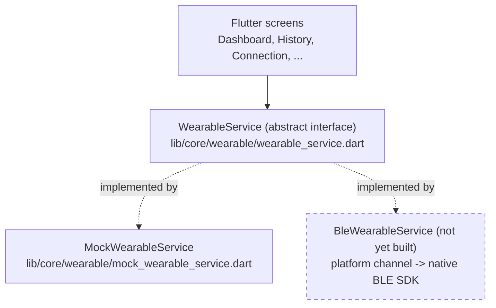
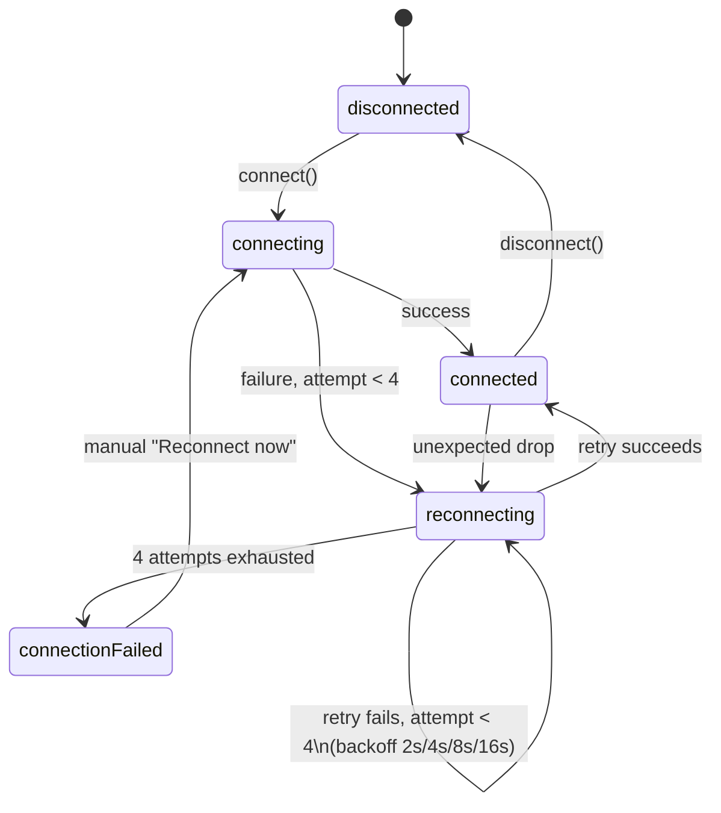

# Wearable integration approach

Three-layer separation, exactly as the assignment's architecture diagram asks:

Screens depend only on the interface: `connectionState` / `readings` /
`reconnectStatus` streams and `connect()` / `disconnect()` / `reconnect()`.
Nothing in `lib/features/` imports `MockWearableService` directly.

## Replacing the mock with a real SDK

Recommended path: **Flutter Platform Channels over a real vendor plugin**,
not raw platform channels hand-rolled per-project.

- Write `BleWearableService implements WearableService` in Dart. It talks
  to a platform channel (`MethodChannel` for commands, `EventChannel` for
  the reading/connection-state streams) instead of a `Timer`.
- **Android**: Kotlin, using the vendor's BLE SDK (or `flutter_blue_plus`
  if the device exposes a standard BLE GATT profile rather than a
  proprietary SDK) inside the platform channel's method/event handlers.
- **iOS**: Swift + CoreBluetooth (or the vendor's iOS SDK), same channel
  contract.
- Swap `MockWearableService()` for `BleWearableService()` at the single
  provider that constructs it (`wearableServiceProvider` in
  `flutter/lib/core/providers/wearable_providers.dart`) — zero screen
  changes, since every screen already depends on `WearableService`, not
  the mock.

**Why platform channels + a thin per-platform native layer, not a
pre-built Flutter BLE package alone:** a real "smart ring" vendor SDK is
almost never a generic BLE GATT profile — it's a proprietary Android AAR /
iOS framework with its own pairing, firmware, and data-encoding handshake.
A generic Flutter BLE plugin gets raw characteristic read/write; the
vendor SDK's own connection and parsing logic still has to run natively
and get bridged over, which is what a platform channel is for. If the ring
did expose standard BLE GATT (heart rate service `0x180D`, battery service
`0x180F`), a Flutter-side BLE plugin would remove the need for native code
almost entirely — worth checking before assuming the native-bridge path.

## Connection handling & retry strategy

`MockWearableService` models the full connection lifecycle the assignment
lists — connected, disconnected, connecting, reconnecting,
connection-failed (`flutter/lib/core/wearable/wearable_connection_state.dart`)
— and implements exponential backoff on unexpected drops: retry delays
2s, 4s, 8s, 16s (4 automatic attempts), then stop and require the user to
tap "Reconnect now" (screen 03,
`flutter/lib/features/connection/presentation/screens/connection_screen.dart`).
A manual reconnect always works, even after auto-retry has given up. This
is a real device concern (BLE stacks don't retry forever either) that a
real SDK-backed `WearableService` would keep, just swapping "simulated
drop" for "OS reported the peripheral disconnected."

## Local health data & History

Every reading — synced or not — is persisted locally the instant the
wearable emits it (`HealthReadingLocalStore`, a Hive box). The History
screen (`flutter/lib/features/history/`) reads and computes its charts
**from that local store**, not the network, so it works fully offline and
reflects just-captured data immediately. See
[OFFLINE_SYNC.md](OFFLINE_SYNC.md) for the store's role in the sync
pipeline.

**Bounded reads.** `HealthReadingLocalStore.recent()` caps at 20 rows
(matching the design's "Showing the latest 20..." note) — it never loads
the full box into a widget. Daily/weekly summaries only scan the last 7
days (`HealthReadingLocalStore.summary`, mirroring the backend's own
`GET /health/summary` window). There is currently no hard cap on the
*box's* total size — see [OFFLINE_SYNC.md](OFFLINE_SYNC.md#shipped)'s
"Explicitly not built" list for the periodic eviction sweep that would
bound it; a deliberate, lower-priority gap.
